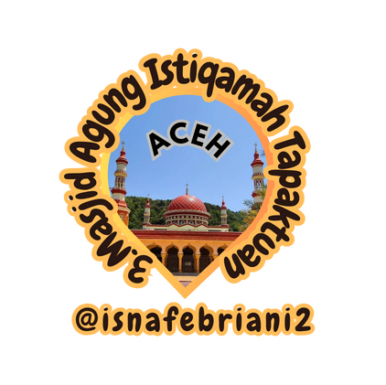
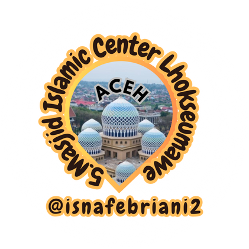
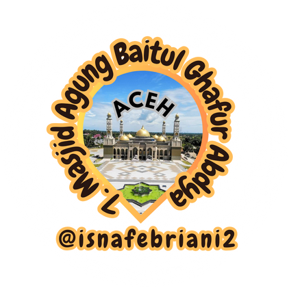
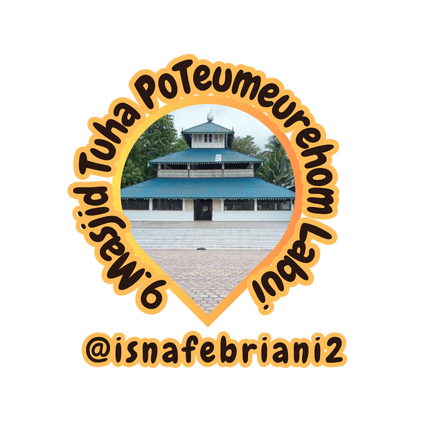

# quran_ft_masjid
memorizing Quran by repetition n get to know indonesian masjid. in syaa Allah

note📓: im nobody just an amatullah whos seeking His Rahmat n Maghfirah.

## Table Of Content

- [Overview](#overview)
- [Getting Started](#getting-started)
  * [The Virtue of Learning Quran and Its Companions](#requirement)
  * [Set Ur Intention](#setup)
  * [Make Doa](#setup1)
  * [Use suitable method](#setup2)
  * [Revision](#setup)
  * [Purify Ur Intention, Seek His Help, and put in the required effort](#setup)

## Overview 
memorizing Quran by repetition n get to know indonesian masjid. in syaa Allah

## Getting Started
### The Virtue of Learning Quran and Its Companions
Berikut beberapa hal yang perlu kita ilmui tentang keutamaan menghafal AlQuran:

1. First [1](https://flutter.dev/docs/get-started/install)
2.

### Set Ur Intention

## Library 

Library contains all credits for making video, i dont own videos, audios, and pictures
git
|Number   |Code (JUZ_PAGE_PART)  |Part Overview |Masjid Description     |Qari |Credits (yt/tt/ig) of (vid/aud/pict,text)|
|----------------------|-----|------------------------------------------------------------------------------------------------|---------|---------|---------|
| [1. Kec. Baiturrahman, Kota Banda Aceh, Aceh]([pub.dev/packages/dartz](https://www.google.com/maps/place/Masjid+Raya+Baiturrahman/data=!4m7!3m6!1s0x3040374934a943ab:0xbabe816ca4be1e2f!8m2!3d5.5535711!4d95.317285!16s%2Fm%2F03h2v33!19sChIJq0OpNEk3QDARLx6-pGyBvro?authuser=0&hl=id&rclk=1))        |`30_604_3`    Surat ke-114, an-Naas, artinya Manusia, lengkap ayat 1-6.       |Kandungannya tentang berlindung dan membentengi diri kepada Allah dari kejahatan setan dan bisikannya serta dari kejahatan-kejahatan yang tersembunyi  |   |Mishary||
| [2. Kec Banda Aceh, Kab Aceh Selatan, Aceh](https://www.google.com/maps/place/Masjid+Agung+Baitul+Makmur+Kabupaten+Aceh+Barat/data=!4m7!3m6!1s0x303ec3a4ba9231bd:0x7bd6dedc9ee1ea71!8m2!3d4.1587055!4d96.1249118!16s%2Fg%2F11b6bcqzdh!19sChIJvTGSuqTDPjARcerhntze1ns?authuser=0&hl=id&rclk=1)        |`30_604_2`  Surat ke-113, al-Falaq, artinya waktu subuh, lengkap ayat 1-5.      |Dijelaskan di dalam surat ini tentang menjaga diri dan berlindung kepada Allah dari kejahatan-kejahatan yang nyata.||Mishary||
| [3.Masjid](pub.dev/packages/dartz)        |`30_604_1`  Surat ke-112 al-Ikhlas, artinya Keesaan Allah, lengkap ayat 1-4.| Yang dikandung di dalam surat ini antara lain penetapan keesaan Allah dalam kesempurnaan dan ketuhanan, serta kesucian Allah dari segala kekurangan.||Mishary||
| [4.Masjid](pub.dev/packages/dartz)        |`30_603_3` Surat ke-111 al-Lahab, artinya gejolak api, lengkap ayat 1-5. |Diterangkan dalam surat ini bahwa nasab dan kedudukan tidak bermanfaat bila berbalut kekufuran pada Allah.||Mishary||
| [5.54JR+2Q4, Simpang Empat, Kec. Banda Sakti, Kota Lhokseumawe, Aceh](https://www.google.com/maps/place/Islamic+Center+Lhokseumawe/data=!4m7!3m6!1s0x3047832eb7f5a6e3:0x7445b24577d1f81e!8m2!3d5.18!4d97.1419444!16s%2Fg%2F1pv1h090f!19sChIJ46b1ty6DRzARHvjRd0WyRXQ?authuser=0&hl=id&rclk=1)        |`30_603_2` Surat ke-110 an-Nashr, artinya pertolongan, lengkap ayat 1-3.| Kandungannya berisi penjelasan tentang Islam yang akhirnya mendapat pertolongan dan kemenangan, dan apa yang disyariatkan ketika hal itu terjadi.||Mishary||
| [6. 4F84+CX2, Kota Panton Labu, Kec. Tanah Jambo Aye, Kabupaten Aceh Utara, Aceh 24394]([pub.dev/packages/dartz](https://www.google.com/maps/place/Masjid+Raya+Pase+Kota+Panton+Labu/data=!4m7!3m6!1s0x30478cd1518b53d3:0xe844b21646cdc55b!8m2!3d5.1160132!4d97.4573873!16s%2Fg%2F1pzsxsby4!19sChIJ01OLUdGMRzARW8XNRhayROg?authuser=0&hl=id&rclk=1))        |`30_603_1`  Surat ke-109 al-Kafirun, artinya Orang-orang kafir, lengkap ayat 1-6. |Berisikan penetapan tauhid ibadah dan berlepas dari kesyirikan serta perbedaan besar antara Islam dan syirik.||Mishary||
| [7.PRWM+Q4W, Seunaloh, Kecamaten Blang Pidie, Kabupaten Aceh Barat Daya, Aceh 23763]([pub.dev/packages/dartz](https://www.google.com/maps/place/Masjid+Agung+Baitul+Ghafur+Abdya/data=!4m7!3m6!1s0x303961887ec92ac5:0x189943d199af48f0!8m2!3d3.7469975!4d96.8328155!16s%2Fg%2F11g6j1w672!19sChIJxSrJfohhOTAR8EivmdFDmRg?authuser=0&hl=id&rclk=1))        |`30_602_3` Surat ke-108 al-Kautsar, artinya Nikmat yang berlimpah, lengkap ayat 1-3.| Menjelaskan tentang karunia Allah terhadap Nabi -ṣallallāhu ‘alaihi wa sallam- dan terputusnya jalan bagi orang-orang yang membenci beliau.||Mishary||
| [8.CC8W+4MJ, Indra Puri, Kec. Indrapuri, Kabupaten Aceh Besar, Aceh 23363](https://www.google.com/maps/place/Masjid+Tua+Indra+Puri/data=!4m7!3m6!1s0x304041089f6031af:0x7826de1b1393809c!8m2!3d5.4153375!4d95.4466406!16s%2Fg%2F11b6dyd6cf!19sChIJrzFgnwhBQDARnICTExveJng?authuser=0&hl=id&rclk=1)        |`30_602_2`Surat ke-107 al-Ma’un, artinya Barang-barang yang berguna, lengkap ayat 1-7.| Mengandung penjelasan tentang akhlak orang-orang yang mendustakan agama dan Akhirat, sebagai bentuk peringatan untuk orang-orang yang beriman dan celaan atas orang-orang kafir.||Mishary||
| [9.9W7Q+832, Labui, Kec. Pidie, Kabupaten Pidie, Aceh 24164](pub.dev/packages/dartz)        |`30_602_1` Surat ke-106 al-Quraisy, artinya Suku Quraisy, lengkap ayat 1-4.| Berisikan pemaparan tentang karunia yang diberikan kepada kaum Quraisy dan apa yang menjadi kewajiban mereka terhadap karunia tersebut.    | |Mishary||

